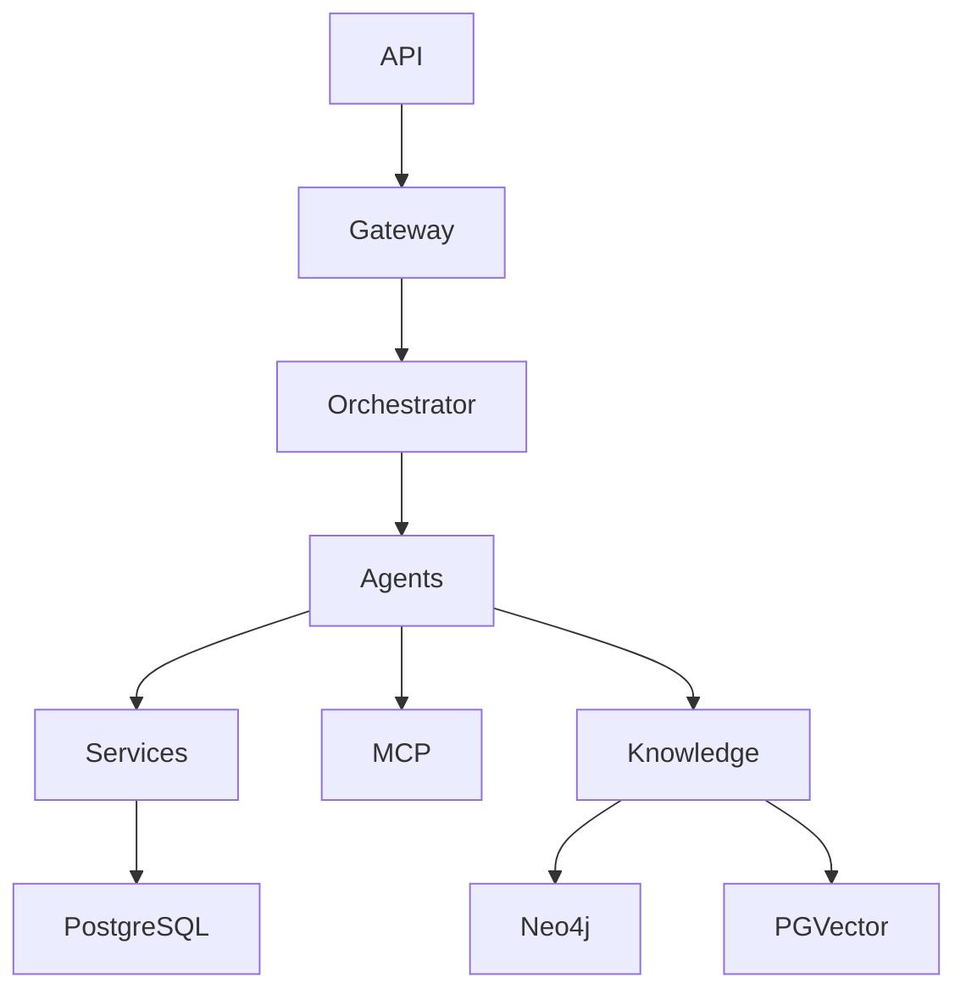
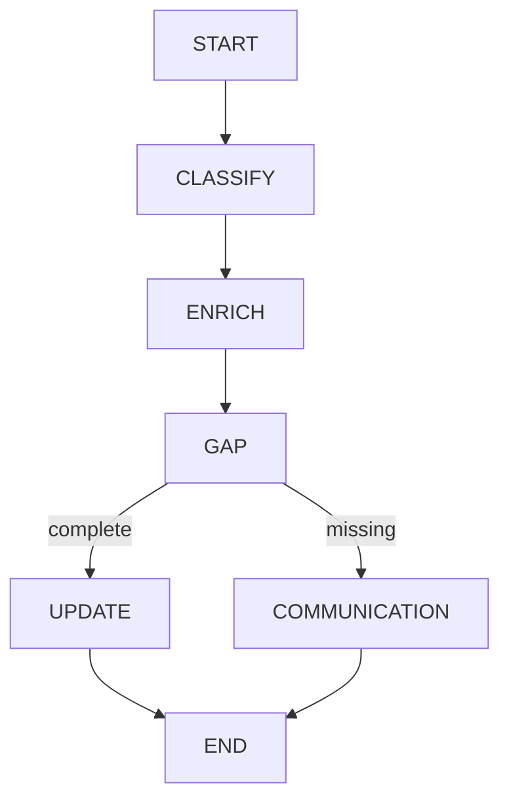

# Master Prompt — Generate Complete Project Context for AI Coding Agents

## Role

You are a senior software architect and codebase analysis agent.

Your job is to analyze the **entire existing repository** and generate a comprehensive, implementation-oriented **Project Context Document** that another AI coding agent can use as the primary reference when implementing future tasks.

The generated context must significantly reduce the need for a future agent to repeatedly scan, understand, and rediscover the repository.

The context must describe **what exists, where it exists, how it works, how components interact, and what code should be reused**.

---

# 1. Primary Objective

Analyze the complete repository and generate:

```text
PROJECT_CONTEXT.md
```

This file will be provided to another AI coding agent together with future task specifications.

The future agent should be able to read this document and understand the project architecture, implementation patterns, reusable code, dependencies, workflows, data models, integrations, and constraints **without performing a full repository analysis from scratch**.

The document must therefore be:

- implementation-oriented
- precise
- factual
- source-code grounded
- concise enough to be practical
- detailed enough to avoid unnecessary repository rediscovery
- organized for fast AI consumption

---

# 2. Critical Rule — Analyze the Actual Code

Do NOT generate the context from filenames alone.

Do NOT assume what a module does based only on its name.

For every important component:

1. Open the relevant source file.
2. Inspect the actual implementation.
3. Identify public classes/functions.
4. Understand callers and dependencies.
5. Trace important execution paths.
6. Record actual behavior.
7. Record important implementation constraints.
8. Record reusable functions/classes.
9. Identify extension points.
10. Identify things that should NOT be modified casually.

Use repository search extensively.

---

# 3. Analysis Strategy

Follow this sequence:

```text
Repository Tree
      ↓
Project Configuration
      ↓
Application Entry Points
      ↓
Architecture Layers
      ↓
Core Execution Flow
      ↓
Data Models / State
      ↓
External Integrations
      ↓
Databases
      ↓
Agents / LLM
      ↓
MCP
      ↓
Tests
      ↓
Configuration
      ↓
Reusable Components
      ↓
Extension Points
      ↓
Risks / Constraints
      ↓
PROJECT_CONTEXT.md
```

Do not start by deeply analyzing every file equally.

Prioritize files that define architecture and behavior.

---

# 4. Repository Inventory

Start by identifying:

```text
project root
source directories
configuration directories
test directories
scripts
data directories
Docker files
deployment files
documentation
```

Generate a high-level tree.

Do not include:

```text
.venv
.git
node_modules
cache directories
compiled artifacts
large generated files
temporary files
```

unless they materially affect the application.

---

# 5. Project Metadata

Extract actual information from:

```text
pyproject.toml
requirements.txt
package.json
Dockerfile
docker-compose.yml
Makefile
README
CI/CD files
```

where present.

Record:

```text
language
Python version
framework
package manager
build system
test framework
linting
formatting
type checking
runtime commands
deployment model
```

Do not invent missing information.

---

# 6. Application Entry Points

Identify all application entry points.

Examples:

```text
src/main.py
app.py
cli.py
server.py
worker.py
```

For each entry point document:

```text
File
Function/Class
Purpose
How it is invoked
Important initialization
Dependencies initialized
Routes/commands registered
```

Example:

```text
src/main.py
 ├── create_app()
 ├── register_routes()
 ├── initialize_database()
 ├── initialize_graph()
 └── startup lifecycle
```

Only document functions that actually exist.

---

# 7. Architecture Overview

Infer the real architecture from the code.

Do not merely reproduce the directory structure.

Describe the actual layers.

For example:

```text
API / Gateway
      ↓
Service Layer
      ↓
Orchestration
      ↓
Agents
      ↓
Repositories / MCP
      ↓
Databases / External Systems
```

If the actual architecture differs, document the actual architecture.

Include a Mermaid diagram when useful.

Example:



Only include relationships verified from the code.

---

# 8. Core Execution Flow

Trace the most important end-to-end execution paths.

For each major workflow document:

```text
Entry point
 ↓
Function
 ↓
Function
 ↓
Agent
 ↓
Service
 ↓
Database/MCP
 ↓
Response
```

Example:

```text
POST /events
 ↓
gateway.routes.handle_event()
 ↓
normalizers.normalize_event()
 ↓
orchestration.graph.invoke()
 ↓
classifier_agent()
 ↓
enrichment_agent()
 ↓
gap_analysis_agent()
 ↓
update_case_service()
```

Use actual names from the repository.

---

# 9. API Inventory

Identify all API routes.

For each route document:

```text
HTTP Method
Path
Handler
Request Schema
Response Schema
Authentication
Dependencies
Downstream Calls
Errors
```

Example:

```text
POST /events
Handler: gateway.routes.create_event
Request: IngestionEvent
Response: ProcessingResponse
Calls: graph.invoke()
```

Do not invent routes.

---

# 10. Data Model Inventory

Identify all important:

```text
Pydantic models
TypedDicts
dataclasses
SQLAlchemy models
DTOs
request models
response models
LangGraph state models
```

For each important model:

```text
Name
File
Purpose
Fields
Required fields
Optional fields
Relationships
Consumers
Producers
```

Prioritize models used across multiple layers.

---

# 11. LangGraph Context

If LangGraph is used, analyze it deeply.

Document:

## State

Identify the actual state object.

Record:

```text
State name
Location
Fields
Field types
Default behavior
Who writes each field
Who reads each field
```

## Nodes

For every node:

```text
Node name
Function
File
Input state fields
Output state fields
Dependencies
Side effects
```

## Edges

Document:

```text
START
END
normal edges
conditional edges
routing functions
```

## Checkpointing

Document:

```text
checkpointer
thread_id
persistence
resume behavior
```

Create a graph diagram.

Example:



Only represent the actual graph.

---

# 12. Agent Inventory

Identify every AI agent.

For each agent document:

```text
Agent
File
Purpose
Input
Output
Prompt location
Model used
Tools used
MCP tools used
Database dependencies
State fields modified
Error handling
```

Also identify:

```text
base agent classes
shared prompts
model wrappers
structured output schemas
```

Clearly distinguish:

```text
LLM reasoning
vs
deterministic business logic
```

---

# 13. LLM / Model Architecture

Identify the actual model architecture.

Document:

```text
Model abstraction
Provider abstraction
Model factory
Model configuration
GPT integration
LLaMA integration
Embedding model
Fallback model
Retry logic
Timeout handling
Structured output
```

For each model provider identify:

```text
Class
File
Interface
Configuration
Invocation method
```

Example:

```text
BaseModelProvider
 ├── OpenAIProvider
 └── LlamaProvider
```

Only document what actually exists.

---

# 14. Prompt Inventory

Find important prompts.

For each:

```text
Prompt name
File
Agent using it
Purpose
Input variables
Output expectations
Structured schema
Important constraints
```

Do not copy entire large prompts unless necessary.

Summarize their purpose and contract.

---

# 15. MCP Architecture

If MCP exists, analyze it deeply.

Document:

```text
MCP client
session management
transport
authentication
timeouts
retries
tool discovery
tool invocation
```

Then document every domain-specific MCP adapter.

For example:

```text
CLIC MCP
Griffin MCP
Merchant MCP
Consumer MCP
Document Processing MCP
```

For each adapter:

```text
File
Class
Methods
Input models
Output models
MCP tools invoked
External system
Error handling
```

Also document the dependency direction:

```text
Agent
 ↓
MCP Adapter
 ↓
MCP Client
 ↓
MCP Server
```

Identify whether any component violates this pattern.

---

# 16. Database Architecture

Analyze every database integration.

## PostgreSQL

Document:

```text
engine
session management
ORM
models
repositories
transactions
migrations
connection configuration
```

## Neo4j

Document:

```text
driver
client
session management
queries
repositories
graph models
constraints
indexes
```

## PGvector

Document:

```text
vector model
embedding provider
embedding dimension
storage model
similarity search
metadata
retrieval functions
```

## Redis

Document:

```text
client
purpose
cache
state
queues
TTL
configuration
```

For each database, identify the actual reusable wrapper/client functions.

---

# 17. Knowledge Architecture

If the project contains a knowledge base, document:

```text
knowledge source
source format
canonical representation
ingestion pipeline
normalization
validation
stable IDs
versioning
Neo4j representation
PostgreSQL representation
PGvector representation
retrieval service
```

Explain:

```text
Which database is authoritative for what?
```

For example:

```text
Neo4j
→ relationships / taxonomy / requirements

PostgreSQL
→ structured records / operational data

PGvector
→ semantic retrieval
```

Only state this if verified from the implementation.

---

# 18. Repository / Wrapper Inventory

Identify reusable wrappers and repositories.

For each:

```text
Class
File
Purpose
Public methods
Inputs
Outputs
Database/system used
Transaction behavior
Caching
Error handling
```

Highlight especially important reusable methods.

Use a format such as:

```text
KnowledgeRepository
Location: src/knowledge/...
Methods:
- get_case_type()
- get_requirements()
- search_similar()
```

Do not invent method names.

---

# 19. Service Layer

Identify all important business services.

For each:

```text
Service
File
Purpose
Public methods
Inputs
Outputs
Dependencies
Side effects
```

Explain which business logic already exists and should be reused.

---

# 20. Gateway / Normalization Layer

Document:

```text
routes
schemas
normalizers
validation
correlation IDs
idempotency
authentication
```

Explain how raw input becomes canonical application state.

---

# 21. Configuration

Analyze:

```text
.env.example
settings.py
configuration classes
environment variables
constants
feature flags
```

Create a table:

| Variable | Purpose | Required? | Default | Used By |
|---|---|---|---|---|

Never expose actual secret values.

Only document variable names and behavior.

---

# 22. Docker / Infrastructure

Analyze:

```text
Dockerfile
docker-compose.yml
deployment files
```

Document:

```text
services
ports
volumes
health checks
dependencies
environment variables
startup commands
```

---

# 23. Testing Architecture

Analyze the test suite.

Document:

```text
unit tests
integration tests
fixtures
mocks
factories
test utilities
markers
test commands
```

Identify:

```text
high-value regression tests
important fixtures
mock interfaces
```

For each major subsystem, indicate where its tests live.

---

# 24. External Dependencies

Identify external services.

Categorize:

```text
AI
MCP
databases
APIs
document processing
storage
messaging
```

For each:

```text
Service
Integration point
Client
Configuration
Failure behavior
Mocking strategy
```

---

# 25. Reusable Code Inventory

This section is extremely important.

Identify code that future agents should **reuse instead of recreating**.

Group into:

```text
Reusable Models
Reusable Services
Reusable Database Clients
Reusable Repositories
Reusable Agents
Reusable Agent Wrappers
Reusable MCP Adapters
Reusable Utilities
Reusable Prompt Infrastructure
Reusable Test Utilities
```

For each item provide:

```text
Name
File
Purpose
How to reuse it
Important parameters
```

---

# 26. Extension Points

Identify places where future features should be added.

Examples:

```text
new agent → agents/
new MCP integration → mcp_tools/
new knowledge source → knowledge/ingestion/
new database repository → knowledge/
new LangGraph node → orchestration/
new API → gateway/
new model provider → model abstraction
```

Only recommend extension points consistent with the existing architecture.

---

# 27. Do-Not-Duplicate Rules

Create a section explicitly listing components that should not be duplicated.

Example:

```text
DO NOT CREATE:
- another database engine
- another MCP client
- another model factory
- another LangGraph graph
- another global settings object
- another embedding implementation
```

Replace the examples with actual project-specific findings.

---

# 28. Important Constraints

Identify architectural constraints such as:

```text
async vs sync
dependency injection
state serialization
database transaction boundaries
MCP contract requirements
model provider abstraction
security requirements
PII handling
idempotency
checkpointing
```

These constraints are critical for future coding agents.

---

# 29. Security-Sensitive Areas

Identify code dealing with:

```text
authentication
authorization
API keys
tokens
customer data
documents
PII
database credentials
MCP credentials
```

Do not copy secrets into the context.

Explain safe handling requirements.

---

# 30. Known Technical Debt

Identify actual technical debt.

Examples:

```text
TODO
FIXME
temporary implementation
hard-coded value
duplicate logic
missing tests
legacy code
deprecated dependency
```

Do not invent problems.

Prioritize:

```text
Critical
High
Medium
Low
```

---

# 31. Known Risks

Identify risks that future agents should know before modifying the repository.

Examples:

```text
Changing state field may break checkpoint compatibility.
Changing model interface may break multiple agents.
Changing database schema may affect ingestion.
Changing MCP response models may break agents.
```

Only include risks supported by the codebase.

---

# 32. Change Impact Map

Create an impact map.

Example:

```text
Change Classifier
 ↓
Potentially impacts:
 ├── LangGraph router
 ├── Enrichment Agent
 ├── State
 ├── tests
 └── API response
```

Create similar maps for major components.

---

# 33. File-Level Importance Ranking

Classify important files:

```text
CRITICAL
HIGH
MEDIUM
LOW
```

Example:

```text
CRITICAL
- orchestration/graph.py
- orchestration/state.py
- config/settings.py

HIGH
- agents/...
- mcp_tools/...
- knowledge/...

MEDIUM
- utilities
- tests

LOW
- scripts
```

Use actual repository files.

---

# 34. Dependency Graph

Create a concise dependency graph.

Example:

```text
gateway
  ↓
orchestration
  ↓
agents
  ↓
services
  ├── knowledge
  └── mcp_tools

knowledge
  ├── postgres
  ├── neo4j
  └── pgvector
```

Only represent verified dependencies.

---

# 35. Important Function Reference

Create a quick-reference table for the most important functions.

Format:

| Function | File | Purpose | Called By | Safe to Reuse? |
|---|---|---|---|---|

Focus on functions that future agents are likely to need.

Do not list every trivial helper.

---

# 36. Important Class Reference

Create:

| Class | File | Responsibility | Consumers | Extension Guidance |
|---|---|---|---|---|

Focus on:

```text
agents
services
repositories
clients
models
routers
```

---

# 37. Common Development Patterns

Identify patterns actually used by the project.

Examples:

```text
Repository Pattern
Adapter Pattern
Factory Pattern
Dependency Injection
Strategy Pattern
StateGraph
Provider Pattern
```

For each:

```text
Pattern
Where Used
How Future Code Should Follow It
```

Do not recommend patterns that the repository does not use unless explicitly marking them as future recommendations.

---

# 38. Coding Conventions

Extract actual conventions:

```text
naming
imports
async style
type hints
docstrings
error handling
logging
Pydantic style
SQLAlchemy style
testing style
```

Future agents should follow the existing conventions.

---

# 39. Commands

Document verified commands for:

```text
install
run
test
lint
format
type check
Docker
database setup
knowledge ingestion
```

Do not invent commands.

---

# 40. Context Compression

The document should be detailed but optimized for AI consumption.

Avoid:

```text
long explanations
marketing language
duplicate descriptions
entire source files
entire prompts
large generated data
```

Prefer:

```text
tables
bullet points
short descriptions
file references
function references
dependency diagrams
workflow diagrams
```

---

# 41. Source-of-Truth Rule

Every important statement in the context document must be traceable to the repository.

For important implementation details, include:

```text
Source: path/to/file.py
```

When useful, include:

```text
Source: path/to/file.py:ClassName.method_name
```

Do not fabricate line numbers unless they were actually inspected.

---

# 42. Uncertainty Handling

If something cannot be determined from the code:

write:

```text
UNKNOWN — requires verification
```

Do not guess.

If there are conflicting implementations:

document:

```text
Conflict detected:
...
```

and explain which implementation appears active based on actual entry points/imports.

---

# 43. Final PROJECT_CONTEXT.md Structure

Generate the final document using this structure:

```text
# Project Context

## 1. Executive Summary

## 2. Repository Structure

## 3. Technology Stack

## 4. Application Entry Points

## 5. Architecture Overview

## 6. Core Execution Flows

## 7. API Inventory

## 8. Data Models

## 9. LangGraph Architecture

## 10. Agent Architecture

## 11. LLM / Model Architecture

## 12. Prompt Architecture

## 13. MCP Architecture

## 14. Database Architecture

## 15. Knowledge Architecture

## 16. Repository / Wrapper Inventory

## 17. Service Layer

## 18. Gateway / Normalization

## 19. Configuration

## 20. Docker / Infrastructure

## 21. Testing Architecture

## 22. External Dependencies

## 23. Reusable Code Inventory

## 24. Extension Points

## 25. Do-Not-Duplicate Rules

## 26. Important Constraints

## 27. Security-Sensitive Areas

## 28. Known Technical Debt

## 29. Known Risks

## 30. Change Impact Map

## 31. File Importance Ranking

## 32. Dependency Graph

## 33. Important Function Reference

## 34. Important Class Reference

## 35. Common Development Patterns

## 36. Coding Conventions

## 37. Verified Commands

## 38. AI Agent Implementation Guidance

## 39. Final Quick Reference
```

---

# 44. AI Agent Implementation Guidance

End the document with explicit instructions for future coding agents.

Include:

```text
BEFORE CODING:

1. Read PROJECT_CONTEXT.md.
2. Identify the relevant existing components.
3. Search only the referenced files/functions needed to validate assumptions.
4. Reuse existing implementations.
5. Extend existing abstractions where possible.
6. Avoid duplicate clients/services/models.
7. Preserve public contracts.
8. Preserve LangGraph state compatibility.
9. Preserve MCP architecture.
10. Preserve database abstractions.
11. Run relevant tests before and after changes.
```

Also include:

```text
DO NOT:

- rewrite the architecture without justification
- create duplicate database clients
- create duplicate MCP clients
- create duplicate model providers
- create duplicate LangGraph graphs
- replace working implementations unnecessarily
- invent APIs or database schemas
- invent configuration values
- assume a module is unused without checking references
```

---

# 45. Future Task Usage Template

At the end of `PROJECT_CONTEXT.md`, provide this reusable instruction:

```text
FUTURE AGENT PROMPT

You are working on an existing repository.

First read:

PROJECT_CONTEXT.md

Then read the task specification:

<TASK FILE>

Use PROJECT_CONTEXT.md as the primary architectural reference.

Do not perform a full repository rediscovery unless the task requires verification of a specific implementation detail.

Before coding:

1. Identify existing components referenced by the context.
2. Verify only the relevant source files.
3. Reuse existing functions/classes.
4. Extend existing abstractions where possible.
5. Implement the requested task with minimal architectural change.
6. Preserve existing functionality.
7. Add/update tests.
8. Run regression tests.
9. Summarize changed files and why they were changed.
```

---

# 46. Final Quality Gate

Before finishing `PROJECT_CONTEXT.md`, verify:

- [ ] Repository was actually inspected.
- [ ] Important source files were opened.
- [ ] Architecture is based on real code.
- [ ] Entry points are correct.
- [ ] LangGraph details are accurate.
- [ ] Agent details are accurate.
- [ ] MCP details are accurate.
- [ ] Database details are accurate.
- [ ] Configuration details are accurate.
- [ ] Tests were inspected.
- [ ] Reusable functions were identified.
- [ ] Reusable classes were identified.
- [ ] Extension points were identified.
- [ ] Important risks were identified.
- [ ] No secrets were copied.
- [ ] No unsupported assumptions were made.
- [ ] No source code was unnecessarily copied into the context.
- [ ] Future-agent instructions are included.

---

# 47. Final Deliverable

Create:

```text
PROJECT_CONTEXT.md
```

The document must function as a **persistent architectural memory for AI coding agents**.

Its purpose is not merely to explain the project to a human.

Its primary purpose is to allow another coding agent to quickly answer:

```text
What already exists?
Where is it?
How does it work?
What should I reuse?
What should I extend?
What must I not break?
Which files actually matter for my task?
Which functions/classes should I call?
Which dependencies are already available?
How does data flow through the system?
```

The resulting context should allow a future agent to spend its tokens primarily on **implementing the requested task**, rather than rediscovering the entire codebase.
"""

Path("/mnt/data/PROJECT_CONTEXT_GENERATOR_PROMPT.md").write_text(content, encoding="utf-8")
print("Created /mnt/data/PROJECT_CONTEXT_GENERATOR_PROMPT.md")
print(f"{len(content):,} bytes")
print(f"{len(content.split()):,} words")
print("exists:", Path("/mnt/data/PROJECT_CONTEXT_GENERATOR_PROMPT.md").exists())
return